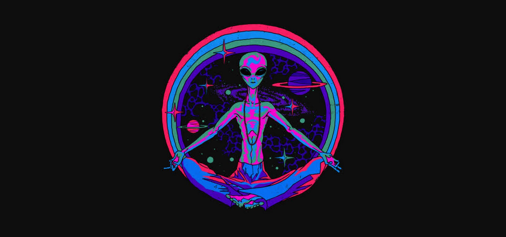

## Hi there
- 📚 I'm currently practicing Java and pentesting 
- 🙋‍♂️ I'm free to give a few hours a week to volunteer (if your project is cool)
- 🌎 I'm a free spirit: I freelance, travel and manage a few startups.
- 🙃 I love to philosophize and sometimes I explore the boundaries of the human consciousness
- 🗺️ Next travel destination - South East Asia and I wish to go for a month to Amazon Rainforest to live with shamans (Brazil/Peru)

## What I do:
### Freelancing

I work primarily on short and medium term projects that take anywhere from 30 minutes to 2-3 months. I develop e-commerce platforms, SaaS, PaaS, web games, automation scripts and so on. I like high degree of novelty and so I always pick different/contrasting projects. At the end of the page, you can find languages and tools that I use. 

### Devancer B.V.
Stage: Currently restructuring, preparing for a scale up. 

The purpose of Devancer is to centralize E-learning by hosting: user created study guides, library (links and references to E-learning content), and a tutor job board. 
Also, the platform provides learning recommendations based on the user's reviews, which will make e-learning process even more efficient. 

Tools: MERN/MEAN, TypeScript, JavaScript, Python, Selenium.

### Neurolight B.V. (tb launched)

Stage: Prototyping. 

The purpose of Neurolight is to provide indoor light with accordance to the most recent findings in neurobiology and ophtalmologie. We need light, but it is not a common knowledge that our patterns of light viewing behavior can significantly affect our mental and physical health. Neurolight's goal is to design and program lights that would provide certain types of light, of certain wavelengths, from certain angles to promote well-being.

Neurolight aims at helping individuals to stick to their circadian rhythms, to promote the release of cortisol in the morning, to promote and protect the release of melatonin in the evening and more. 

Tools: Tons of lights and constructing materials, Python, Flask, Raspberry Pi.

### Connect with me:

 

### Languages and Tools:
CSS: CSS3, Bootstrap, Material UI, jQuery, Semantic UI, Tailwind CSS

Frontend: HTML5, JavaScript, Typescript, React, Angular, Jinja2

Backend: Node.js, Express, Python, Flask, Django, Java

Mobile: React Native

Databases: mySQL, MongoDB, Firebase, SQLite, Postgres

Other tools: Docker, Git, AWS, Jira

Data scraping: Selenium, BeautifulSoup

Data analytics: Google Colab, Matplotlib, Pandas, Plotly, Seaborn, IBM SPSS, Jupyter

Data visualization: Tableau

 
